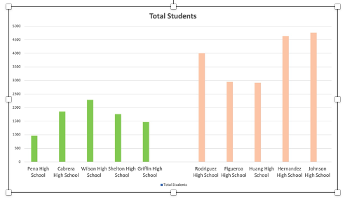
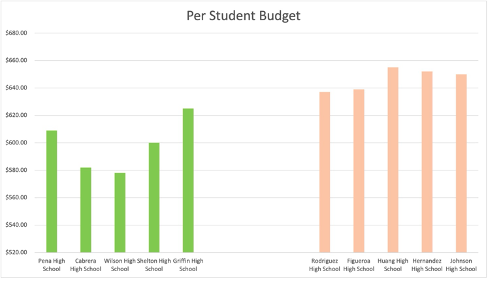

Trends in school performance 

based on data from school_complete.csv and students_complete.csv
Aleksandra Kutz 
Module 4 Challenge

	The report below was prepared based on two databases. One of them was a csv document titled “school_complete” and it contained data regarding the school name, type, size and budget. The second document titled “students_complete” contained information about the school name, student name, math, reading and overall passing scores, as well as information about the student's grade and gender.
Calculating the average math, reading and overall pass rates for each school, as well as comparing these results with the number of students in a given school, allowed me to observe the following trends:

The analysis revealed that five schools with the highest pass rates had an average student population of 1,666 per school, whereas five schools with the lowest pass rates had a significantly larger average student population of 3,852 per school.

 

This allows me to conclude that the size of the school matters, and the larger the school, 
the more difficult it is to achieve higher pass rates. What could be the reason for this? 

Managing larger schools presents unique challenges. With larger class sizes, teachers have limited time to provide individual attention to each student, potentially hindering support for those struggling with the material. This can result in difficulties in identifying and assisting students who may be falling behind academically.
In addition to academic concerns, larger schools encounter administrative obstacles related to coordination, communication, and decision-making. These challenges can impact the overall effectiveness of the school in fostering student success.
Moreover, the sheer scale of larger schools poses logistical challenges in organizing classes, facilitating effective communication between students and teachers, and coordinating various school activities. The school board must oversee meetings, events, and schedules, and the increasing student population can strain these organizational efforts, potentially influencing the academic performance of students within the school.

	The second trend I noticed is the fact that:

The five schools with the best pass rates had an average budget of $ 598.8 per student per school, while the five schools with the lowest pass rates had an average budget of $ 646.6 per student per school. 

 

	This allows me to conclude that if the average budget per student varies between schools by up to USD 50, it does not appear to have a significant impact on the improvement of the pass rate of a given school.

	What could be the reason for this? The observed discrepancy in average budgets per student between schools with the highest and lowest pass rates, amounting to a mere $50 difference, suggests that such a marginal variation does not significantly impact a school's pass rate. This nominal budget variance may not sufficiently enhance learning conditions for individual students, nor compensate for the advantages of smaller class sizes and increased teacher attention. Moreover, in larger schools, the allocation of funds may be less efficient due to the complexities of managing a larger student body. The diverse needs and interests of a larger student population pose challenges in adequately addressing them and providing tailored resources to all students.

The last trend I will present here is the visible difference between the type of school and the pass rate.

The five schools with the best pass rates were all charter schools. The five schools with the lowest pass rate were all a district schools. 

This allows me to conclude that the type of school matters. 

The question is why does the type of school matter so much? Why the five best schools are charter schools, and the five lowest are district school? There may be several reasons for this. The significant impact of school type on academic performance, with the top five schools being charter schools and the bottom five being district schools, can be attributed to several factors. Charter schools enjoy greater autonomy and independence in decision-making, enabling them to implement innovative teaching programs and tailor additional initiatives to meet students' current needs. Moreover, in charter schools, parental involvement is often higher, fostering a supportive learning environment and establishing a strong support network for students. The sense of community within charter schools facilitates the early identification of students struggling with certain subjects, leading to prompt assistance and academic support. This collaborative environment likely contributes to the higher pass rates observed in charter schools.

Report limitations:

Given that the analysis was conducted on a sample of only 15 schools, it may not be representative enough to generalize findings to the entire population of schools. Additionally, the absence of data regarding the specific city and state locations of the surveyed schools is a limitation, as regional factors could potentially influence the pass rates observed. Therefore, caution should be exercised when extrapolating the conclusions of this report to a broader educational context.

Based on the information presented in the report, the following conclusions can be drawn:

 	When a school aims to enhance its students' pass rates within a fixed budget, investing in the organization and structure of the school may yield greater benefits than simply increasing the budget per student. By optimizing the school's layout and operations, such as increasing the number of classes and reducing class sizes, a school can create more conducive learning environments. Schools with greater autonomy and independence, like charter schools, are better positioned to deliver tailored educational services that address students' specific needs effectively. Given the notable success of charter schools compared to district schools, further in-depth research into the underlying factors driving this disparity is warranted. Such comprehensive investigation can lead to more precise conclusions and inform strategic actions that may help district schools achieve similarly impressive educational outcomes.

